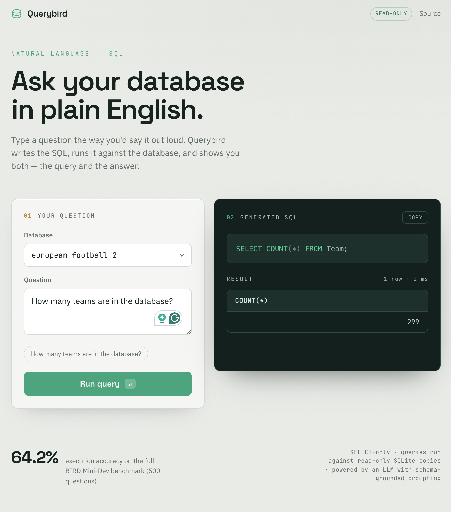

# Querybird

Ask a database questions in plain English. Querybird turns the question into SQL, runs it against the database, and shows you both — the query it wrote and the answer. It ships as a **live web app** and as a **reproducible benchmark pipeline** that scores itself at **64.2% execution accuracy on the full 500-question BIRD Mini-Dev set**, built through iterative failure analysis rather than a single prompt.



## Two ways to run it

- **Live app** — a FastAPI backend with a query UI: pick a database, type a question, and see the generated SQL (syntax-highlighted) and the result table. Generated SQL runs against read-only SQLite copies and is restricted to `SELECT` only.
- **Benchmark pipeline** — the command-line evaluation that produced the headline number, scored with BIRD's official evaluator.

Both share the same core generation logic (`sql_generation.py`), so the app and the benchmark run identical code.

## How It Works

The problem is simple to state and hard to do well: a user asks a question in English ("which customer paid the most in EUR?"), and the system has to produce SQL that returns the correct answer from a database it's never been told the contents of. The core is one loop:

**Schema grounding.** For the target database, the system reads its full schema — the CREATE TABLE statements for every table — so the model knows what columns and relationships exist before it writes anything.

**Generation.** The schema, the question, and (in the benchmark) an "evidence" hint are sent to the LLM, which returns a single SQLite query. The raw output is cleaned — markdown fences stripped, whitespace flattened — before execution, because a model formats for humans and a database needs raw SQL.

**Execution.** In the app, the query runs against a **read-only** connection and is validated to be a single `SELECT`/`WITH` statement (no `INSERT`/`UPDATE`/`DELETE`/`DROP`/`PRAGMA`/`ATTACH`), with a timeout and a row cap. In the benchmark, correctness is judged by **Execution Accuracy (EX)**: a query counts as correct only if it runs, finishes within a timeout, and returns the same result set as the human-written gold query — scored with BIRD's **official** evaluator, not a custom comparison, so the number is comparable to how the benchmark is reported everywhere else.

The improvements over the baseline came from prompt changes motivated by reading real failures, not guessing — resolving foreign keys to human-readable names, matching exact stored value formats, and fixing an output-formatting bug that was silently failing the hardest questions.

## Performance

All numbers are Execution Accuracy on the **full 500-question** BIRD Mini-Dev set, scored by the official `evaluation_ex.py`.

| Split | Questions | EX |
|-------|:---------:|:---:|
| **Total** | 500 | **64.20%** |
| Simple | 148 | 76.35% |
| Moderate | 250 | 62.80% |
| Challenging | 102 | 50.00% |

Baselines for context:

- Zero-shot LLM approaches on BIRD dev historically sit in roughly the 40s.
- Purpose-built, heavily-engineered text-to-SQL systems on the BIRD leaderboard reach the 70s.
- A general-purpose, prompt-engineered pipeline at 64% is a reasonable middle — with accuracy falling cleanly as difficulty rises (76 → 63 → 50), which is what a sound pipeline should show.

The development stages (baseline → prompt tuning → a reverted experiment) were measured on a fast 50-question sample for cheap iteration, then the final system was confirmed on all 500. The full experiment log — including a change that *looked* promising, measured worse, and was rolled back — is in [RESULTS.md](RESULTS.md).

## Tech Stack

- **Python 3.13** — generation pipeline, evaluation wrapper, backend
- **Anthropic API (`claude-sonnet-5`)** — SQL generation from natural language
- **FastAPI + Uvicorn** — query API and static-file serving for the app
- **SQLite (stdlib `sqlite3`)** — the databases queried at inference time, opened read-only
- **Vanilla JS / HTML / CSS** — frontend, no framework (custom SQL syntax highlighter)
- **BIRD official evaluator** — execution-accuracy scoring
- **python-dotenv** — API key management

## Project Structure

```
querybird/
├── sql_generation.py        # Shared core: schema fetch, prompt, generation, fence-strip
├── server.py                # FastAPI backend: /api/databases, /api/query, serves the app
├── frontend/
│   ├── index.html           # Query UI
│   ├── styles.css           # "Translation desk" theme
│   └── app.js               # Fetch logic, SQL highlighting, result rendering
├── generate_predictions.py  # Batch: SQL for N questions in BIRD's prediction format
├── run_eval.py              # Wrapper: generate → prep gold/diff files → official scorer
├── inspect_failures.py      # Categorizes failures (ERROR vs WRONG_RESULT) for analysis
├── RESULTS.md               # Experiment log: baseline → 64.2%, with failure analysis
├── requirements.txt
├── .gitignore
└── minidev/                 # BIRD Mini-Dev data (gitignored — downloaded separately)
```

## Running Locally

**1. Clone and set up the environment**

```bash
git clone <repo-url>
cd querybird
python -m venv venv
source venv/bin/activate
pip install -r requirements.txt
```

Add your Anthropic API key to a `.env` file:

```
ANTHROPIC_API_KEY=sk-ant-...
```

**2. Download the benchmark data**

Download the BIRD Mini-Dev complete package from
[github.com/bird-bench/mini_dev](https://github.com/bird-bench/mini_dev) and unzip it so
that `minidev/MINIDEV/mini_dev_sqlite.json` and `minidev/MINIDEV/dev_databases/` exist.

### Run the app

```bash
uvicorn server:app --reload
```

Open **http://127.0.0.1:8000** — pick a database, type a question, and run it. Each query
makes one LLM call.

### Run the benchmark

Clone the official evaluator alongside this repo, then score:

```bash
git clone https://github.com/bird-bench/mini_dev.git ../bird-official

python run_eval.py --limit 50     # develop on a small sample
python run_eval.py --limit 500    # full-set evaluation
```

Inspect failures (free — reuses already-generated predictions):

```bash
python inspect_failures.py --limit 50
```

## Data

Questions and databases come from **BIRD Mini-Dev** — 500 human-written question / gold-SQL
pairs across 11 databases (finance, football, formula 1, healthcare, and others), each with a
labeled difficulty (simple / moderate / challenging). The gold queries serve as the answer
key that makes execution accuracy measurable.

## Development Log

**The idea.** I wanted to fill a specific gap: I had no project touching LLMs or retrieval, and a generic "chat with your PDFs" app would have read as a tutorial. Text-to-SQL fit better — it's an AI problem that can be *measured* the way I measure everything else, against a benchmark with a real answer key. The core is one loop: take an English question, show the model the schema, get SQL, run it, score it against the known-correct query.

**Getting the scorer working.** I used BIRD's official evaluator rather than writing my own comparison, so the number would be credible and comparable. Reading its source paid off — it turned out to compare result *sets* (ignoring row order, silently de-duplicating), which is a blind spot worth knowing about when you quote the metric. Getting it to actually run was the usual real-world friction: two of the 500 gold rows have a space where a tab should be (a typo in the benchmark's own data), the difficulty file wanted JSONL where the download shipped plain JSON, and the evaluator only imports correctly when run from inside its own folder. I wrapped all of that into a single `run_eval.py` so a full run is one command instead of six fiddly ones.

**The pivotal decision — looking at failures before fixing them.** Baseline was 64% on the dev sample. The obvious next feature was self-correction (feed SQL errors back to the model and retry). Instead I built a failure inspector first, and it changed everything: of the failures, only *one* was an execution error — and it was a leftover formatting bug, not real. The rest ran fine and returned the wrong rows. That meant self-correction would have fixed almost nothing. I'd have spent days building the wrong thing. Reading the actual wrong answers instead surfaced two fixable patterns: the model returning foreign-key IDs instead of the joined human-readable names, and mismatching exact stored values (filtering 'Orange' when the data says 'Orange County').

**Prompt fixes: 64% -> 76% (on the dev sample).** Two cheap changes aimed at those two patterns — instruct the model to resolve foreign keys to names, and to match the full stored value form — plus fixing the fence bug. Twelve points, with the gain landing in exactly the bucket I predicted, which is the evidence it worked for the right reason. It wasn't perfectly clean: re-inspecting showed the "be literal" steer regressed two aggregation questions. Prompt tuning has side effects, and measuring per-bucket is how you catch them.

**An experiment that failed, honestly.** I hypothesized that injecting sample rows into the schema would fix the remaining "wrong data format" failures. It helped the moderate bucket (58 -> 68) but regressed simple (92 -> 84) and came out net negative overall (76 -> 74). More context is not free — it helps where information is the bottleneck and hurts where the model was already fine and the extra tokens are just noise. I reverted it. Keeping that dead end in the record is the point: the process is measure, diagnose, try, re-measure, and roll back when the data says so.

**The honest headline.** Every improvement above was measured on the first 50 questions — fine for fast iteration, too few to quote. The final system on the full 500 scored **64.2%**, lower than the 50-question figure because the full set spans harder, unseen databases. A defensible 64% on the whole benchmark beats an optimistic 76% on a favorable slice.

**The app.** Once the pipeline was solid, I wrapped the shared generation code in a FastAPI backend and a small vanilla-JS frontend so it's usable, not just scorable. Generated SQL runs on a read-only connection and is rejected unless it's a single `SELECT`/`WITH` statement — the model never gets to modify data, which is the kind of guardrail a real deployment needs.

## Potential Extensions

- **Few-shot retrieval (RAG):** embed the training questions, retrieve the most similar solved question->SQL pairs at inference time, and inject them as examples — the natural next accuracy lever and the piece that makes this a genuine retrieval system.
- **Targeted value sampling:** show distinct values of date/text columns only, rather than full sample rows — the moderate-bucket gain suggests the format *signal* helps while full-row noise hurt.
- **Deployment:** host the app publicly (with per-query rate limiting and a spend cap) so it's a shareable link, not a local clone.
- **Full-500 confidence:** repeat runs to put error bars on the headline number.
